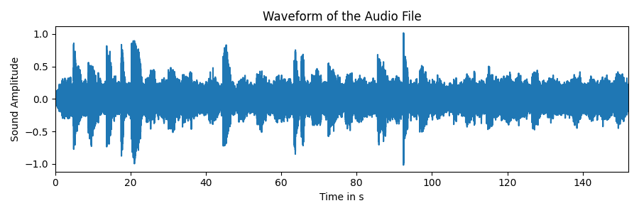
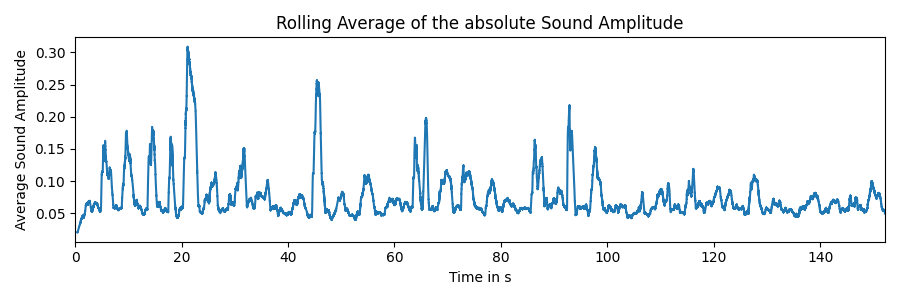
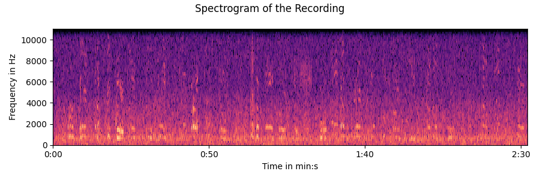
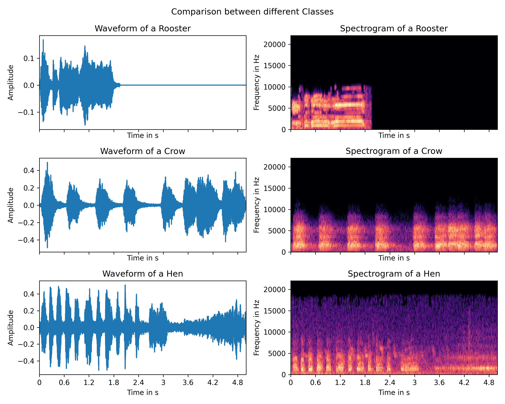
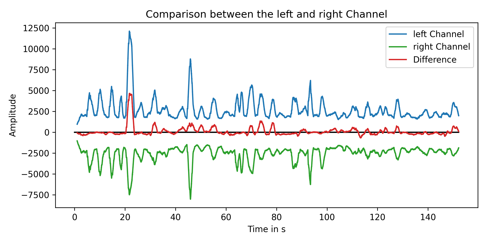
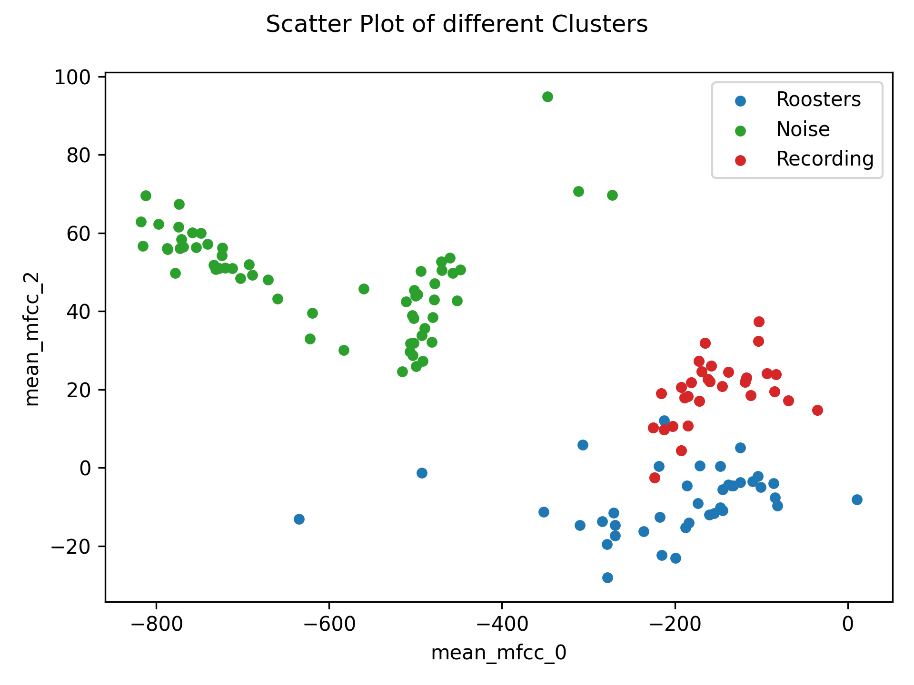
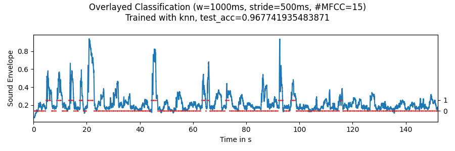
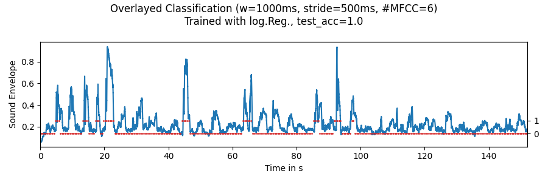
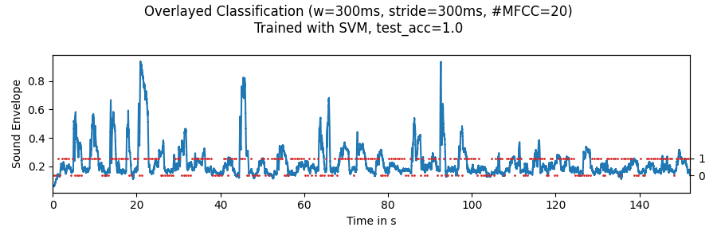
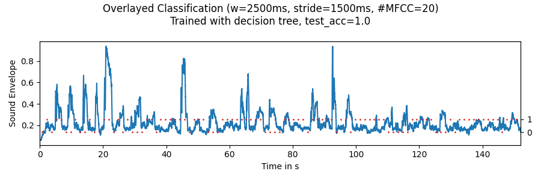

# Rooster Competition
## Instructions
Find the rooster with the longest crow duration ([rooster_competition.wav](./rooster_competition.wav)). You may use available datasets for solving this problem (e.g. [karolpiczak/ESC-50](https://github.com/karolpiczak/ESC-50)). The final concept should provide the following information as an output:
1. Total number of roosters
2. Duration of crow from each rooster in the competition using the format  
`<rooster name>:<duration in milliseconds>`
3. Ranking of roosters by crow length using the format  
`<rank>:<rooster name>`  
(the rooster with the longest crow gets the first place. Assume that the roosters have numbers as names, so the first rooster’s name in the competition is ‘1’, second is ‘2’, etc.)

## Data Analysis
### Recording
The recording has the following parameters
- Sample Rate: 48000 Hz
- Channels: 2
- Duration: 02:32.137 min
- Format: WAV

For a first intuition, 33 rooster crows can be manually counted by listening to the sound file.  

  
This is the plot of the waveform as it is known from various audio players. It represents the change of air pressure that is recorded by the microphone and converted into a digital signal. To clean up the plot, the absolute value of the sound amplitude is calculated and a rolling average is applied to generate the envelope of the audio information.

  

Now there are distinct spikes visible that refer to the loudness of individual sounds in the recording. The clearly higher spikes are representations of loud rooster crows. Some of the smaller crows are harder to distinguish from the ambient noise which mostly consists of people talking and bird chirps in the background.

  
To distinguish the different sounds further, a short-time Fourier transform is used to convert the signal into the frequency domain. The x-axis stays the same but the y-axis now represents the intensity of each frequency given at the specific time.

### Data Set
In order to train a classification model, the [karolpiczak/ESC-50](https://github.com/karolpiczak/ESC-50) dataset will be used. It consists of 2000 recordings, each 5 seconds long. The recordings are from 50 different classes, each with 40 examples. Here is an overview over the different classes.

| Animals | Natural soundscapes & water sounds  | Human, non-speech sounds | Interior/domestic sounds | Exterior/urban noises |
| :--- | :--- | :--- | :--- | :--- |
| Dog | Rain | Crying baby | Door knock | Helicopter |
| **Rooster** | Sea waves | Sneezing | Mouse click | Chainsaw |
| Pig | Crackling fire | Clapping | Keyboard typing | Siren |
| Cow | Crickets | Breathing | Door, wood creaks | Car horn |
| Frog | Chirping birds | Coughing | Can opening | Engine |
| Cat | Water drops | Footsteps | Washing machine | Train |
| Hen | Wind | Laughing | Vacuum cleaner | Church bells |
| Insects (flying) | Pouring water | Brushing teeth | Clock alarm | Airplane |
| Sheep | Toilet flush | Snoring | Clock tick | Fireworks |
| Crow | Thunderstorm | Drinking, sipping | Glass breaking | Hand saw |

For further understanding, here is a side-by-side comparison of three different records of roosters, crows and hens:

  

To recreate the results easily, make sure the `ESC-50-master` folder is in the `dataset` directory. You also might have to manually create the folders `noise` and `search-windows` in the `dataset` directory.

## Assumptions
1. **Each crow is from a different rooster**  
As the different roosters will be named by their order of appearance in the original recording, there will be as many different roosters as there are distinct crows. There will be no approach to detect whether different crows belong to the same rooster, so the actual amount of roosters in the recording might very well be lower. However, the task is to detect crows with different durations which is not a conflict with the described assumption.

2. **There is no valuable directional information**  
After analyzing the original recording and comparing the left and the right channels, it can be assumed that, apart from a few crows that appear closer to the left channel, there is no valuable information loss by converting the stereo recording into a single channel sound file.

## Approach
As you can see in the previous dataset analysis, there is a distinct class *Rooster* in the [ESC-50](https://github.com/karolpiczak/ESC-50) dataset that can be used to train a classifier. According to the <q>No-Free-Lunch-Theorem</q> the model will perform better if the classifier is trained to just detect rooster crows.  

  

The training and testing sets will therefore consist of the 40 rooster recordings and a mixture of different background recordings from other sources. To create a binary classification model, the [ESC-50](https://github.com/karolpiczak/ESC-50) recordings of rooster crows are used in a combination with sections taken out of the following three sound recordings:  
- [market.wav](./dataset/market.wav) <small>`BY` VincePest11 at [freesound.org](https://freesound.org/people/VincePest11/sounds/326016/)</small>
- [restaurant.wav](./dataset/restaurant.wav) <small>`BY` stephan at [soundbible.com](http://soundbible.com/1664-Restaurant-Ambiance.html)</small>
- [birds.wav](./dataset/birds.wav) <small>`BY` hargissssound at [freesound.org](https://freesound.org/people/hargissssound/sounds/345851/)</small>

After further study of the spectrogram, the Mel-frequency cepstral coefficients can be found as promising candidates for dataset features. As seen in the plot, the noise and rooster recordings can be cleanly separated. As the recording was split into five seconds long samples, all of those are close to the rooster recordings.

  

The following architectures are trained for classification:
- k-nearest neighbors with 2 neighbors
- Support-Vector-Machine
- Decision Tree
- Logistic Regression

The recording will be split into sections of a set width and these sections can be moved over the recording with a set stride to create multiple single data points that will be passed to the trained model. Afterwards a voting based system is used to determine which stride blocks are considered classified as a rooster crow and which are not. A threshold is used to require a certain amount of votes for each block.

Finally, all consecutive blocks are summed up and the respective duration in milliseconds is calculated based on the set parameters.

As required, the summary information is printed to the terminal.

## Results
Multiple combinations of parameters were tested. To evaluate the results, the classification result is overlaid over the envelope of the sound amplitude based on the same time scale to reference classifications to spikes in the audio signal. As the ground-truth of the recording is not known, a visual inspection is performed.

  

  

  

  

The most promising setup is the k-nearest neighbors model. It does not detect all crows but it seems to perform the best on duration estimation.

## Future Ideas
For further improvement, different aspects can be considered:
- Use the mel-spectrogram as image data and train state-of-the-art image classification deep neural networks
- Apply preprocessing like low- and high-pass filters to the recording
- Train the classification model with more than two classes to generalize better